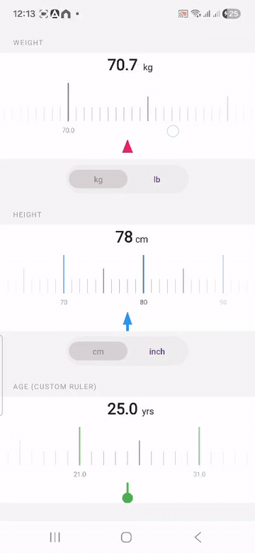

# RulerKit

[](https://jitpack.io/#theadityatiwari/RulerKit)



A highly customizable horizontal ruler picker for Android. Supports weight, height, distance, and fully custom input types. Available as both a classic **View** (`RulerPickerView`) and a native **Jetpack Compose** composable (`RulerPicker`). Built on `Canvas` with smooth fling/snap animation, haptic feedback, and automatic unit conversion.

---

## Installation

**Step 1.** Add JitPack to your root `settings.gradle.kts`:

```kotlin
dependencyResolutionManagement {
    repositories {
        maven("https://jitpack.io")
    }
}
```

**Step 2.** Add the dependency:

```kotlin
dependencies {
    implementation("com.github.theadityatiwari:RulerKit:v1.0.0")
}
```

---

## View — Quick Start

### XML

```xml
<com.nativeknights.rulerkit.RulerPickerView
    android:id="@+id/rulerPicker"
    android:layout_width="match_parent"
    android:layout_height="160dp"
    app:rulerInputType="weight"
    app:rulerUnit="kg"
    app:rulerInitialValue="70"
    app:indicatorType="triangle"
    app:indicatorColor="#E91E63" />
```

### Kotlin

```kotlin
val ruler = findViewById<RulerPickerView>(R.id.rulerPicker)

// Value changes while scrolling
ruler.onValueChanged = { value, unit ->
    println("$value $unit")
}

// Settled value after drag/fling ends
ruler.onScrollEnd = { value, unit ->
    println("Settled at $value $unit")
}

// Switch units at runtime (converts value automatically)
ruler.setUnit(WeightUnit.LB)

// Set value programmatically
ruler.setValue(75f, animate = true)

// Read current value
val current = ruler.getValue()
```

### Programmatic config

```kotlin
ruler.config = RulerConfig(
    inputType      = InputType.Weight(WeightUnit.KG),
    initialValue   = 70f,
    indicatorType  = IndicatorType.ARROW,
    indicatorColor = 0xFF2196F3.toInt(),
    showLabels     = true,
    tickSpacingDp  = 14f
)
```

### Custom ruler

```kotlin
ruler.config = RulerConfig.custom(
    min         = 1f,
    max         = 120f,
    step        = 1f,
    unitLabel   = "yrs",
    majorEvery  = 10,
    mediumEvery = 5
)
```

---

## Compose — Quick Start

```kotlin
val state = rememberRulerPickerState(RulerConfig.weight())

RulerPicker(
    state    = state,
    modifier = Modifier.fillMaxWidth().height(160.dp),
    onValueChanged = { value, unit ->
        println("$value $unit")
    },
    onScrollEnd = { value, unit ->
        println("Settled at $value $unit")
    }
)
```

### Unit switch

```kotlin
val scope = rememberCoroutineScope()

Button(onClick = { scope.launch { state.setUnit(WeightUnit.LB) } }) {
    Text("lb")
}
```

### Programmatic value

```kotlin
scope.launch { state.setValue(75f, animate = true) }
```

### Custom config

```kotlin
val state = rememberRulerPickerState(
    RulerConfig(
        inputType      = InputType.Weight(WeightUnit.KG),
        initialValue   = 70f,
        indicatorType  = IndicatorType.ARROW,
        indicatorColor = 0xFF2196F3.toInt(),
        tickSpacingDp  = 14f
    )
)
```

### Read current value

```kotlin
val live    = state.currentValue   // updates every frame
val settled = state.snappedValue   // stable after gesture ends
```

---

## XML Attributes (View only)

| Attribute | Values / Type | Default |
|-----------|--------------|---------|
| `rulerInputType` | `weight` `height` `distance` `custom` | `weight` |
| `rulerUnit` | `kg` `lb` `cm` `inch` `km` `miles` `meters` | `kg` |
| `rulerMinValue` | float | unit default |
| `rulerMaxValue` | float | unit default |
| `rulerInitialValue` | float | min |
| `rulerCustomStep` | float | — |
| `rulerCustomUnitLabel` | string | — |
| `rulerCustomMajorEvery` | integer | 10 |
| `rulerCustomMediumEvery` | integer | 5 |
| `indicatorType` | `line` `triangle` `arrow` `pin` | `triangle` |
| `indicatorPosition` | `centerTop` `centerBottom` | `centerBottom` |
| `indicatorColor` | color | `#E91E63` |
| `indicatorSize` | dimension | `20dp` |
| `indicatorWidth` | dimension | `2dp` |
| `majorLineHeight` | dimension | `56dp` |
| `majorLineWidth` | dimension | `2dp` |
| `majorLineColor` | color | `#212121` |
| `mediumLineHeight` | dimension | `36dp` |
| `mediumLineWidth` | dimension | `1.5dp` |
| `mediumLineColor` | color | `#757575` |
| `minorLineHeight` | dimension | `20dp` |
| `minorLineWidth` | dimension | `1dp` |
| `minorLineColor` | color | `#BDBDBD` |
| `showLabels` | boolean | `true` |
| `labelTextSize` | dimension | `11sp` |
| `labelTextColor` | color | `#424242` |
| `showValueLabel` | boolean | `true` |
| `valueLabelTextSize` | dimension | `26sp` |
| `valueLabelTextColor` | color | `#212121` |
| `rulerBackgroundColor` | color | `#FFFFFF` |
| `tickSpacing` | dimension | `12dp` |
| `flipVertically` | boolean | `false` |
| `enableHapticFeedback` | boolean | `true` |

All `RulerConfig` properties are also available programmatically for both `RulerPickerView` and `RulerPicker`.

---

## Requirements

- minSdk 24
- Kotlin 2.x
- Compose BOM 2024.09.00+ (for `RulerPicker`)
- `android.permission.VIBRATE` is merged automatically from the library manifest

---

## Roadmap

- ~~**Phase 2** — Jetpack Compose (`RulerPicker` composable)~~ ✅ Done
- **Phase 4** — Kotlin Multiplatform / Compose Multiplatform (iOS, Desktop)
